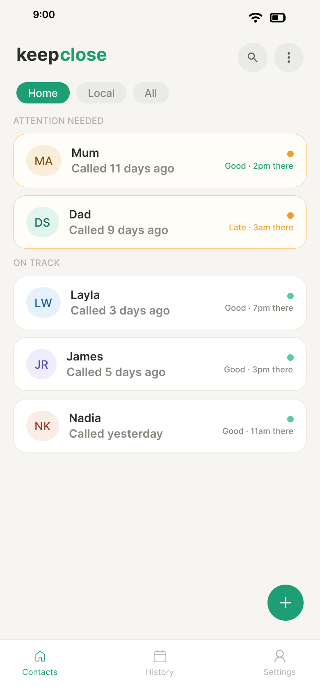
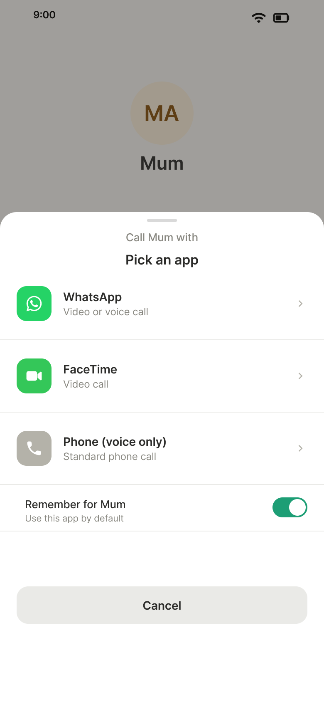

# keepclose — Wellbeing-Maintenance Calling Tool

A wellbeing-oriented mobile app concept designed to support international students experiencing homesickness and loneliness, by helping them maintain regular contact with the people who matter to them.

The project covered user research, requirements derivation, high-fidelity prototyping, and scenario-based evaluation. It was developed as my dissertation for my "BSc Computer Science (Software Engineering)" degree at Newcastle University, supervised by Dr Nick Taylor.

**Figure 1.** The Contacts screen showing contacts grouped into *Attention Needed* and *On Track*. Each row shows the contact's avatar, days since last call, and a one-word status alongside the contact's local time.

## Project Outputs

- [View Figma Prototype](https://www.figma.com/proto/0B8tftOfGUGLy5E3CEovnf/CSC3094--Prototype?node-id=5-2&p=f&t=t9PPbauTl4bC6bGU-1&scaling=scale-down&content-scaling=fixed&page-id=0%3A1&starting-point-node-id=5%3A2)
- [Read Dissertation](Ayoub-Aldawood-keepclose-Dissertation.pdf)

## Skills Demonstrated

- UX Design
- Human-Computer Interaction (HCI)
- Wellbeing-Supportive Design
- Mobile App Design
- Figma
- User Research
- Information Architecture
- Iterative Prototyping
- Evaluation
- Requirements Engineering

## Design Approach

The project followed a human-centred design process, anchored in Peters' (2023) wellbeing-supportive design framework. The framework emphasises autonomy-respecting, low-pressure interactions for systems intended to support psychological wellbeing over time — and it shaped both what was designed (a maintenance layer, not a behaviour-change system) and how it was evaluated (whether the design *felt* supportive, not only whether tasks could be completed).

Key design moves:

- **Layer-over-replacement.** keepclose surfaces drift and launches the user into their existing calling apps rather than competing with them.
- **Deliberate restraint.** No streaks, no scores, no aggregate connection-health metric, no gamified comparison between contacts.
- **Calm visual language.** Muted palette, generous spacing, neutral microcopy throughout.
- **Two-tap principle.** Any primary action is reachable within two taps from app launch.

**Figure 2.** The Quick Call Launch modal sheet, summoned from Contact Detail. A single tap launches the user's preferred calling app — reinforcing keepclose as a layer over existing calling tools rather than a replacement for them.

## Research and Evaluation

### Phase 1 — Survey

A 50-respondent online survey of international students provided the evidence base for the design. Survey findings were translated into seven functional and seven non-functional requirements, and a five-area information architecture: Contacts, Contact Detail, Quick Call Launch, Connection History, and Add Contact.

### Phase 2 — Evaluation

The high-fidelity prototype was evaluated through scenario-based walkthroughs with ten international students. Sessions combined task-based observation with post-task and overall reflection questions, designed to surface both usability and how the prototype felt to use.

**Key findings:**

- All ten participants completed the three core user journeys without outright failures.
- The most reliably endorsed element of the design was what it *omitted*: the absence of streaks, scores, and gamified comparison was endorsed unanimously.
- All ten endorsed the layer-over-replacement model, recognising that the value of the design lay in *deciding who to call and quickly launching the right app*, rather than in providing a new calling platform.
- Refinements identified: microcopy on the *Attention Needed* and *Calling Goal* phrasings carried more directive weight than intended; the prototype's protective principles around privacy and opt-out paths needed to be made more visible at the surface, not only present in the implementation.

## About

BSc Computer Science (Software Engineering) dissertation, Newcastle University, May 2026. Supervisor: Dr Nick Taylor.

> The project's central argument is that wellbeing-oriented relational technology may need to be defined as much by what it refuses to do as by what it positively offers.
